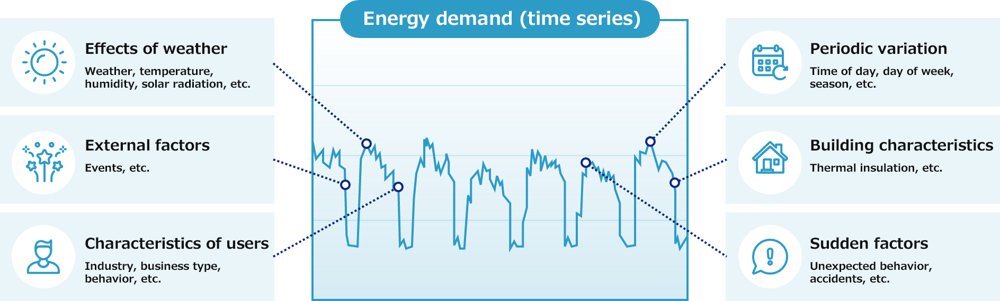
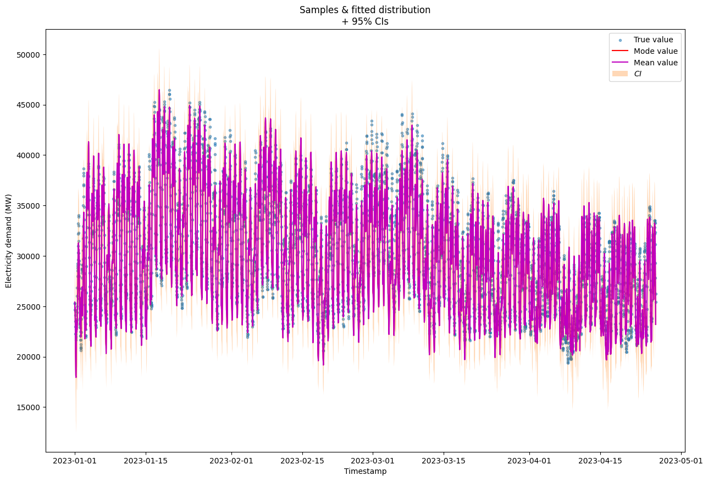

# Proyecto de Pronóstico de Demanda Eléctrica en el Reino Unido

## Tabla de Contenidos
1. [Resumen del Proyecto](#resumen-del-proyecto)
2. [Descripción de los Datos](#descripcion-de-los-datos)
3. [Modelos de Pronóstico](#modelos-de-pronostico)
4. [Métricas de Evaluación](#metricas-de-evaluacion)
5. [Resultados e Ideas Clave](#resultados-e-ideas-clave)
6. [Conclusiones](#conclusiones)
7. [Trabajos Futuros](#trabajo-futuro)

## 1. Resumen del Proyecto 
Este repositorio proporciona un enfoque de pronóstico de series temporales para predecir la demanda eléctrica en el Reino Unido. El repositorio incluye diversos modelos y técnicas específicamente diseñados para pronosticar la demanda eléctrica, teniendo en cuenta datos históricos, patrones estacionales y otros factores relevantes. Además, el repositorio incluye scripts de preprocesamiento de datos, métricas de evaluación de modelos y cuadernos de ejemplo para guiar a los usuarios en la comprensión e implementación del enfoque de pronóstico. El objetivo de este repositorio es ayudar a investigadores, científicos de datos y profesionales de la energía a predecir con precisión la demanda eléctrica en el Reino Unido, lo que permite una mejor planificación y toma de decisiones en el sector energético.

## 2. Descripción de los Datos 
El conjunto de datos proporcionado por el operador [UK National Grid](https://data.nationalgrideso.com) incluye observaciones de demanda eléctrica (en megavatios) medidas en cada media hora de un día desde enero de 2009 hasta abril de 2023. Además, los datos meteorológicos se obtuvieron de los [servicios de datos meteorológicos de Visual Crossing](https://www.visualcrossing.com/weather/weather-data-services), desde enero de 2009 hasta diciembre de 2023, que incluye la temperatura promedio diaria, la humedad, la velocidad del viento y otras variables meteorológicas. 
El conjunto de datos consta de dos archivos separados: uno para los datos de demanda eléctrica y otro para los datos meteorológicos. 
Los valores faltantes se completaron y las características estacionales cíclicas se transformaron utilizando funciones seno y coseno. Además, se creó un archivo adicional para almacenar solo las características de tiempo.

### Datos de Demanda Eléctrica:
| Variable          | Descripción                        |
|-------------------|------------------------------------|
| settlement_date   | Fecha y hora de la observación      |
| settlement_period | Media hora de la observación       |
| tsd               | Demanda eléctrica en megavatios    |
| ...               | Otras variables relevantes         |

### Datos Meteorológicos:
| Variable          | Descripción                        |
|-------------------|------------------------------------|
| datetime          | Fecha y hora de la observación      |
| temp              | Temperatura promedio diaria        |
| humidity          | Humedad                            |
| windspeed         | Velocidad del viento               |
| ...               | Otras variables meteorológicas     |

Composición del Conjunto de Datos:
- Número total de observaciones de demanda eléctrica de media hora: 250 942
- Número total de observaciones meteorológicas diarias: 5 479

## 3. Modelos de Pronóstico 
Para abordar el problema, se utilizó un enfoque de pronóstico de series temporales. Se consideraron varios modelos, incluidos:
- Modelos autorregresivos estacionales: SARIMAX.
- Modelos de regresión en conjunto: Extreme Gradient Boosting (XGB).
- Modelos aditivos generalizados: Prophet.
- Redes neuronales: Perceptrón Multicapa Gaussiano (GMLP).

Se tuvieron en cuenta las suposiciones de cada modelo y su relevancia para el problema. Después de estudiar las soluciones proporcionadas por estos modelos, se hicieron varias observaciones.

- Los modelos SARIMAX requerían ajustes manuales, lo que resultaba un proceso lento y desafiante, exigiendo un profundo entendimiento tanto del problema como del modelo. Además, los modelos SARIMAX tenían suposiciones estrictas que podrían ser difíciles de cumplir con los datos de demanda eléctrica disponibles.
- El modelo Prophet, un paquete popular desarrollado por Facebook, demostró ser efectivo para este tipo de problema. Agrega información estacional durante su entrenamiento. El modelo puede ajustarse manualmente, pero no es necesario para obtener un rendimiento aceptable. También es capaz de modelar la incertidumbre en los datos.
- Extreme Gradient Boosting, un algoritmo de aprendizaje automático en conjunto utilizado para regresión, también se consideró ya que puede establecer relaciones entre variables de entrada y salida, sin requerir restricciones estrictas en los datos.
- Las redes neuronales son reconocidas por su capacidad para modelar relaciones complejas y no lineales en los datos. Además, un perceptrón multicapa gaussiano es capaz de manejar la incertidumbre en los datos.

Basado en el análsis anterior, el modelo SARIMAX se descartó para un análisis posterior.

## 4. Métricas de Evaluación 
Se evaluaron los modelos utilizando diversas métricas, incluidas:
- Error cuadrático medio (MSE).
- Raíz del error cuadrático medio (RMSE).
- Error absoluto medio (MAE).
- Error porcentual absoluto medio (MAPE).
- Análisis de gráficos residuales, considerando componentes estacionales.

El mejor modelo fue seleccionado en función de los valores generales más bajos de las métricas y de los residuos distribuidos normalmente.

## 5. Resultados e Ideas Clave 
Se proporcionaron gráficos de predicción para el pronóstico de la demanda eléctrica del último año en los datos. Se encontró que los modelos puramente estacionales eran insuficientes, y se requirieron modelos de regresión para modelar las relaciones meteorológicas. Se encontraron desafíos al ajustar la demanda durante el verano. También se discutieron otros desafíos relacionados con este problema.

## 6. Conclusión 
En conclusión, este cuaderno presenta los resultados y hallazgos del proyecto de pronóstico de demanda eléctrica en el Reino Unido. A través de un análisis exhaustivo y experimentación, el proyecto confirmó que tener en cuenta las características estacionales y la información meteorológica es crucial para minimizar los errores de pronóstico en la demanda eléctrica. Los modelos que consideraron estos factores mostraron un rendimiento mejorado en comparación con los modelos puramente estacionales. Después de una evaluación detallada, el modelo GMLP se destacó como el mejor intérprete entre los modelos considerados. Mostró los valores más bajos para las métricas clave de evaluación, produjo residuos distribuidos normalmente y manejó eficientemente la incertidumbre. Estas características consolidan al modelo GMLP como la opción preferida para un pronóstico preciso de la demanda eléctrica.

## 7. Trabajos Futuros 
Es crucial identificar períodos críticos para el pronóstico de la demanda y definir valores de error aceptables para esta tarea. Se requiere una mayor exploración del impacto de la información meteorológica por hora en los resultados del pronóstico. Se podrían descubrir características adicionales analizando combinaciones de parámetros estacionales, como el período del día y el mes. Considerar los días festivos y fines de semana como una sola característica también podría mejorar la precisión del pronóstico. Explorar la relación temporal entre las características y la demanda podría mejorar la precisión y la robustez del modelo.