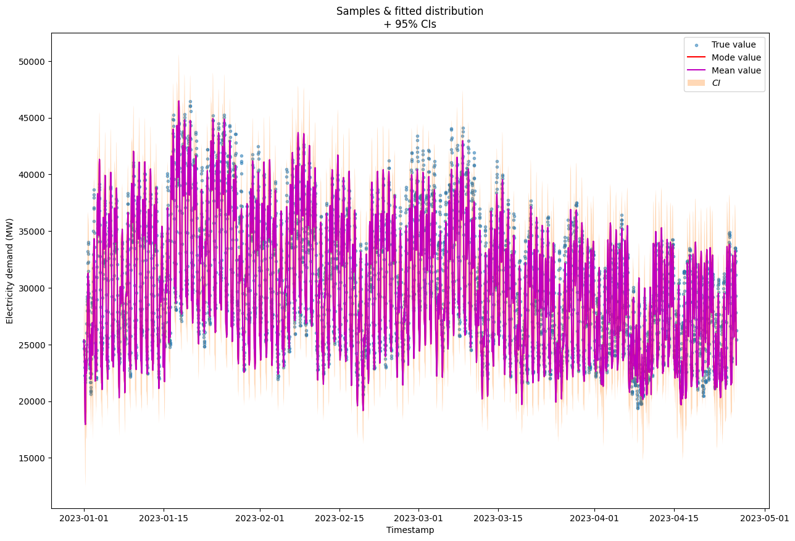

# UK Electricity Demand Forecasting Project

## Table of Contents
1. [Project Overview](#project-overview)
2. [Data Description](#data-description)
3. [Forecasting Models](#forecasting-models)
4. [Evaluation Metrics](#evaluation-metrics)
5. [Results and Insights](#results-and-insights)
6. [Conclusion](#conclusion)
7. [Future Work](#future-work)

## 1. Project Overview 
This [repository](https://github.com/avillalon-dev/Forecasting.ElectricityDemand.UK) provides a time-series forecasting approach to predict the electricity demand in the United Kingdom (UK). The repository includes various models and techniques specifically designed for forecasting electricity demand, taking into account historical data, seasonal patterns, and other relevant factors. The repository also provides data preprocessing scripts, model evaluation metrics, and example notebooks to guide users in understanding and implementing the forecasting approach. The goal of this repository is to assist researchers, data scientists, and energy professionals in accurately predicting electricity demand in the UK, enabling better planning and decision-making in the energy sector.

## 2. Data Description 
The dataset provided by the [UK National Grid](https://data.nationalgrideso.com) operator includes observations of electricity demand (in megawatts) measured in each half-hour of a day from January 2009 until April 2023. Additionally, weather data was obtained from [Visual Crossing weather data services](https://www.visualcrossing.com/weather/weather-data-services), from January 2009 until December 2023, which includes average daily temperature, humidity, windspeed, and other weather variables. 
The dataset consists of two separate files: one for electricity demand data and the other for weather data. 
Missing values were filled, and cyclical seasonal features were transformed using sine and cosine functions.Adicionally, one more file was created to store only time features.

### Electricity Demand Data:
| Variable          | Description                         |
|-------------------|-------------------------------------|
| settlement_date   | Timestamp of the observation        |
| settlement_period | Half hour of the observation        |
| tsd               | Electricity demand in megawatts     |
| ...               | Other relevant variables            |

### Weather Data:
| Variable    | Description                         |
|-------------|-------------------------------------|
| datetime    | Timestamp of the observation        |
| temp        | Average daily temperature           |
| humidity    | Humidity                            |
| windspeed   | Windspeed                           |
| ...         | Other relevant weather variables    |

Dataset Composition:
- Total number of half-hour period electricity demand observations: 250 942
- Total number of daily weather observations: 5 479

## 3. Forecasting Models 
To address the problem, a time-series forecasting approach was employed. Various models were considered, including:
- Seasonal auto-regressive models: SARIMAX.
- Ensemble regression models: Extreme Gradient Boosting (XGB).
- Generalized additive models: Prophet.
- Neural networks: Gaussian Multilayer Perceptron (GMLP).

Each model's assumptions and relevance to the problem were considered. After studying the solutions provided by these models, several observations were made.

- SARIMAX models required manual tuning, which was a time-consuming and challenging process, demanding a deep understanding of both the problem and the model. Additionally, SARIMAX models had strict assumptions that could be difficult to guarantee with the available electricity demand data.
- Prophet model, a popular package developed by Facebook, proved to be effective for this type of problem. It adds seasonal information during its training. The model can be manually tune, but it is not necessary to get an acceptable performance. It is also capable of modeling uncertainty in the data. 
- Extreme Gradient Boosting, an ensemble machine learning algorithm used for regression, was also considered as it could establish relationships between input and output variables, without requiring strict constraints on the data. 
- Neural networks are recognized for their ability to model complex and non-linear relationships in the data. Additionally, a gaussian multilayer perceptron is able to handle the uncertainty in the data.

Based on these findings, the SARIMAX model was discarded from further analysis.

## 4. Evaluation Metrics 
The models were evaluated using various metrics, including:
- Mean Squared Error (MSE).
- Root Mean Squared Error (RMSE).
- Mean Absolute Error (MAE).
- Mean Absolute Percentage Error (MAPE).
- Residual plots analysis, considering seasonal components.

The best model was selected based on lower overall metric values and normally distributed residuals.

## 5. Results and Insights 
Prediction plots for electricity demand forecast from the last year in the data were provided. It was found that purely seasonal models were insufficient, and regression models were necessary to model weather relationships. Challenges were encountered in fitting the demand during summer. Other challenges were discussed related to this problem. More information can be found [here](forecast_electricity_demand.html).

## 6. Conclusion 
In conclusion, this notebook presents the results and findings of the UK electricity demand forecasting project. Through comprehensive analysis and experimentation, the project confirmed that accounting for seasonal features and weather information is crucial to minimize forecasting errors in electricity demand. Models that considered these factors showed improved performance compared to purely seasonal models. After thorough evaluation, the GMLP model emerged as the best performer among the considered models. It exhibited the lowest values for key evaluation metrics, produced normally distributed residuals, and efficiently handled uncertainty. These characteristics solidify the GMLP model as the preferred choice for accurate electricity demand forecasting.

## 7. Future Work 
It is crucial to identify critical periods for demand forecasting and define acceptable error values for this task. Further exploration of hourly weather information's impact on prediction results is necessary. Additional features could be discovered by analyzing combinations of seasonal parameters, such as day period and month. Considering holidays and weekends as a single feature may also improve forecasting accuracy. Explore the temporal relation in the features and the demand may improve accuracy and robustness.
